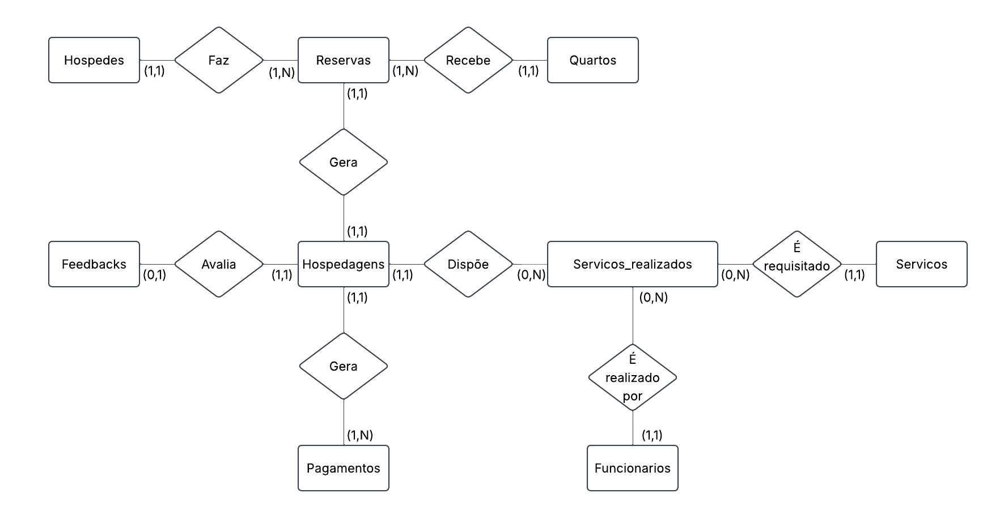
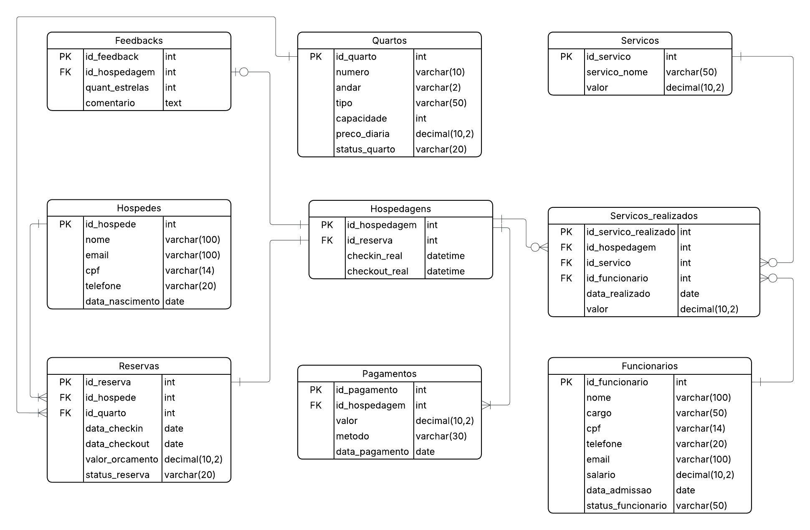

# Hotel Nebula 

Atividade para aprender os fundamentos de modelagem dos dados, implementação de banco, extração e organização de dados com a rede de Hotel Nebula.

### Enunciado da atividade
[Acessar enunciado](https://github.com/gabaugusto/sample-databases/tree/main/Tabelas/8_HOTEL_NEBULA)

## Parte 1: Origem do Sistema

### Modelagem conceitual

### Modelagem lógica

## Parte 2: Montagem do Núcleo

Implementação física do banco relacional.

[Criação do banco](./SQL/criacao_banco.sql)

[Inserção dos dados](./SQL/inserir_dados.sql)

[Documentação da estrutura](./partes/parte2.md)

## Parte 3: Radar de Comando

Consultas SQL e extração de dados

[Consultas](./partes/parte3.md)

[Arquivo sql consultas](./SQL/consultas.sql)